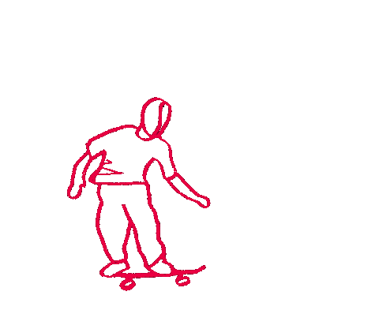

Adding gif to posts is the same as adding images. The steps can be fetched in [Add Images In Doks Posts 📎]().

When gifs are added, I find out that some gifs are not playing but just stationary images, which is not what I want. Later I figure out that gifs only work in `<Image>` status, that means that to keep gifs playing, we should make sure that the `smallLimit` in `params.toml` is greater than the width of gif file, thus gifs will work as `<Image>` status.

```toml
# ./config/_default/params.toml
smallLimit = 2000
```

And then it works. Then gif shows like



* See also in [issue#593](https://github.com/h-enk/doks/issues/593).
