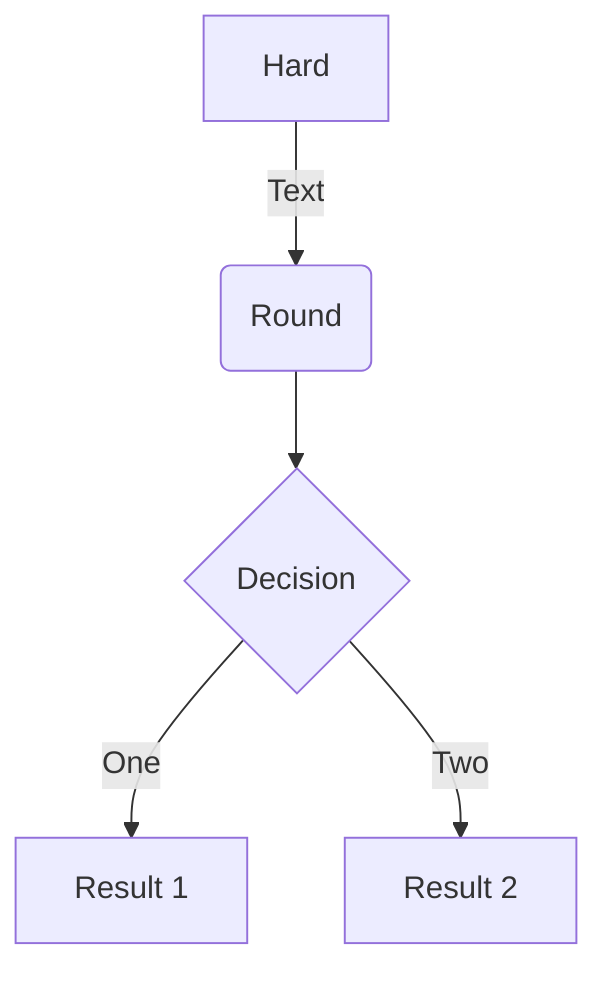

Every time we need `mermaid` support, we add `mermaid: true` to the metadata of the page we need.

Here is a example.

```mermaid
graph TD
  A[Hard] -->|Text| B(Round)
  B --> C{Decision}
  C -->|One| D[Result 1]
  C -->|Two| E[Result 2]
```

It works good.
